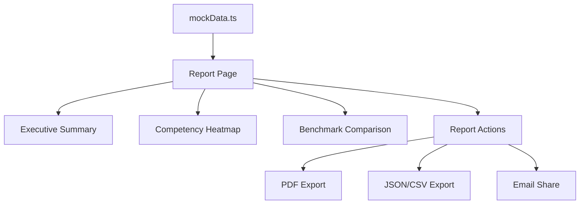

# AI 해커톤 운영 성과 리포트 시스템

## 개요

대학 실무진을 위한 포괄적인 성과 분석 리포트 시스템입니다. 참가자 역량 진단, 행사 성과 측정, 타 대학 벤치마크 비교 등 핵심 기능을 제공합니다.

## 주요 기능

### 1. Executive Summary (경영진용 1페이지 요약)

**목적**: 대학 경영진이 30초 안에 핵심 내용을 파악할 수 있도록

**포함 내용**:
- 숫자 3개: 참가자 수, AI 역량 성장률, 만족도
- 임팩트 문장: 핵심 성과를 한 문장으로 요약
- Before/After 시각화: 원형 차트로 역량 변화 표시
- 다음 단계 제안

**구현 파일**: `components/ExecutiveSummary.tsx`

### 2. 참가자 역량 분포 히트맵

**목적**: 전체 참가자의 AI 역량을 5개 영역별로 시각화

**핵심 기능**:
- 참가자별 5개 영역 점수를 색상으로 표현
- Lv.1~5 레벨 분포 표시
- 정렬 기능 (이름, 레벨, 각 영역별)
- 레벨별 필터링
- AS-IS / TO-BE 비교 분석

**구현 파일**: `components/CompetencyHeatmap.tsx`

**데이터 구조**:
```typescript
interface ParticipantCompetency {
  id: string;
  name: string;
  level: number; // 1-5
  scores: {
    understanding: number;    // AI 이해도
    toolUsage: number;       // 도구 활용능력
    problemSolving: number;  // 문제 해결력
    collaboration: number;   // 협업/커뮤니케이션
    ethics: number;         // 윤리적 판단력
  };
}
```

### 3. 타 대학 벤치마크 비교

**목적**: 참여 대학 평균 대비 자교 학생 수준 비교

**핵심 지표**:
- 사전/사후 평균 점수
- 역량 성장률
- 참가자 만족도
- NPS 점수
- 프로젝트 제출률

**시각화**:
- 막대 차트: 우리 대학 vs 평균 비교
- 레이더 차트: 종합 역량 프로필
- 순위 테이블: 전체 대학 순위
- 인사이트 카드: 강점/개선 영역 자동 분석

**구현 파일**: `components/BenchmarkComparison.tsx`

**데이터 구조**:
```typescript
interface UniversityBenchmark {
  university: string;
  participantCount: number;
  avgPreScore: number;
  avgPostScore: number;
  growthRate: number;
  satisfaction: number;
  nps: number;
  projectSubmitRate: number;
}
```

### 4. PDF/CSV 내보내기

**지원 형식**:
- **PDF**: `window.print()` 기반 브라우저 인쇄 (인쇄 최적화 CSS 포함)
- **JSON**: 프로그래밍 방식 데이터 처리용
- **CSV**: Excel/스프레드시트 분석용

**추가 기능**:
- 이메일로 공유 (기본 메일 클라이언트 연동)
- 요약 복사 (마크다운 형식)

**구현 파일**: `lib/pdfExport.ts`, `components/ReportActions.tsx`

## 리포트 구조

### Layer 1 — Executive Summary (1페이지)
```
┌─────────────────────────────────────┐
│ 핵심 지표 3개                        │
│ - 참가자 수                          │
│ - AI 역량 성장률                     │
│ - 만족도                            │
├─────────────────────────────────────┤
│ 임팩트 문장                          │
├─────────────────────────────────────┤
│ Before/After 시각화                  │
├─────────────────────────────────────┤
│ 다음 단계 제안                       │
└─────────────────────────────────────┘
```

### Layer 2 — 성과 분석 리포트 (본문)

#### 섹션 1: 행사 개요
- 행사 기본 정보
- 행사 목적 및 주제

#### 섹션 2: 참가자 통계
- 참가자 수, 팀 수, 제출률
- 학년별/전공별 분포 차트

#### 섹션 3: AI 역량 진단 결과 (핵심 차별점)
- **3.0**: Pre/Post 5개 영역별 비교
- **3.1**: 전체 참가자 역량 히트맵
  - 사전 진단 히트맵
  - 사후 진단 히트맵
  - AS-IS/TO-BE 레벨 분포 비교
- **3.2**: 타 대학 벤치마크
  - 6개 지표 비교 카드
  - 막대/레이더 차트
  - 순위 테이블
  - 인사이트 분석

#### 섹션 4: 프로젝트 성과
- 트랙별 프로젝트 분포
- 팀별 평가 점수 테이블

#### 섹션 5: 심사 결과
- 심사 기준 (5개 항목)
- 수상 팀 상세 내역

#### 섹션 6: 참가자 피드백
- NPS 점수
- 항목별 만족도 (6개)
- 긍정/개선 피드백

#### 섹션 7: 후속 트래킹
- 프로젝트 지속 개발
- 창업/취업 연계
- 대외 수상

#### 섹션 8: 종합 결론
- KPI 달성 여부
- 단기/중기/장기 개선 계획

## 사용 방법

### 1. 리포트 페이지 접근

```
/admin/hackathons/[id]/report
```

### 2. 데이터 준비

리포트는 다음 데이터 소스를 사용합니다:

```typescript
// lib/mockData.ts
export const mockHackathons = [...];
export const mockParticipants = [...];
export const mockTeams = [...];
export const mockSurveys = [...];
export const mockFollowUps = [...];
export const mockBenchmarkData = [...]; // NEW
```

### 3. PDF 내보내기

리포트 상단의 "PDF로 저장" 버튼 클릭 → 브라우저 인쇄 대화상자 → "PDF로 저장" 선택

**인쇄 최적화**:
- A4 용지 크기
- 여백: 상하 1.5cm, 좌우 2cm
- 색상 정확도 보장 (`-webkit-print-color-adjust: exact`)
- 페이지 나누기 최적화
- 차트/표 보존

### 4. 데이터 내보내기

**JSON 내보내기**:
```typescript
import { exportReportJSON } from '@/lib/pdfExport';
exportReportJSON(reportData);
```

**CSV 내보내기**:
```typescript
import { exportReportCSV } from '@/lib/pdfExport';
exportReportCSV(reportData);
```

## 기술 스택

- **Frontend**: Next.js 16, React 19, TypeScript
- **UI**: Tailwind CSS 4
- **Charts**: Recharts 3.8
- **Icons**: Lucide React 1.7

## 파일 구조

```
app/admin/hackathons/[id]/report/
├── page.tsx              # 메인 리포트 페이지
├── ReportCharts.tsx      # 차트 컴포넌트 (기존)
└── print.css            # 인쇄 스타일

components/
├── ExecutiveSummary.tsx        # Executive Summary
├── CompetencyHeatmap.tsx       # 역량 히트맵
├── BenchmarkComparison.tsx     # 벤치마크 비교
└── ReportActions.tsx           # 내보내기 액션 버튼

lib/
├── pdfExport.ts               # PDF/CSV 내보내기 유틸
├── mockData.ts                # 모의 데이터 (벤치마크 추가)
└── types.ts                   # 타입 정의
```

## 데이터 흐름



## 확장 계획

### 단기 (파일럿 단계)
- [x] PDF 자동 생성
- [x] 히트맵 시각화
- [x] 벤치마크 비교
- [ ] 이메일 자동 발송

### 중기 (스케일업 단계)
- [ ] 웹 대시보드 (대학별 로그인)
- [ ] 필터링/드릴다운 기능 강화
- [ ] 실시간 데이터 업데이트
- [ ] 모바일 최적화

### 장기 (데이터 자산화)
- [ ] 벤치마크 자동화 (누적 데이터)
- [ ] AI 기반 인사이트 생성
- [ ] 연간 구독 모델
- [ ] API 제공

## 성과 지표

### 대학 입장에서 중요한 지표
1. **절대 점수보다 변화량**: "평균 52점 → 67점, +15점"
2. **레벨 분포 변화**: "Lv.3 이상 34% → 61%"
3. **타 대학 대비 순위**: "참여 대학 평균 대비 +12%"
4. **후속 성과**: "6개월 후 창업 3팀, 대외 수상 2팀"

### 리포트의 차별점
- ✅ 정량적 역량 진단 (Before/After)
- ✅ 개인별 역량 히트맵
- ✅ 타 대학 벤치마크 (경쟁력 증빙)
- ✅ 후속 추적 (장기 임팩트)

## 문의

추가 기능이나 개선 사항이 필요하시면 개발팀에 문의해주세요.
